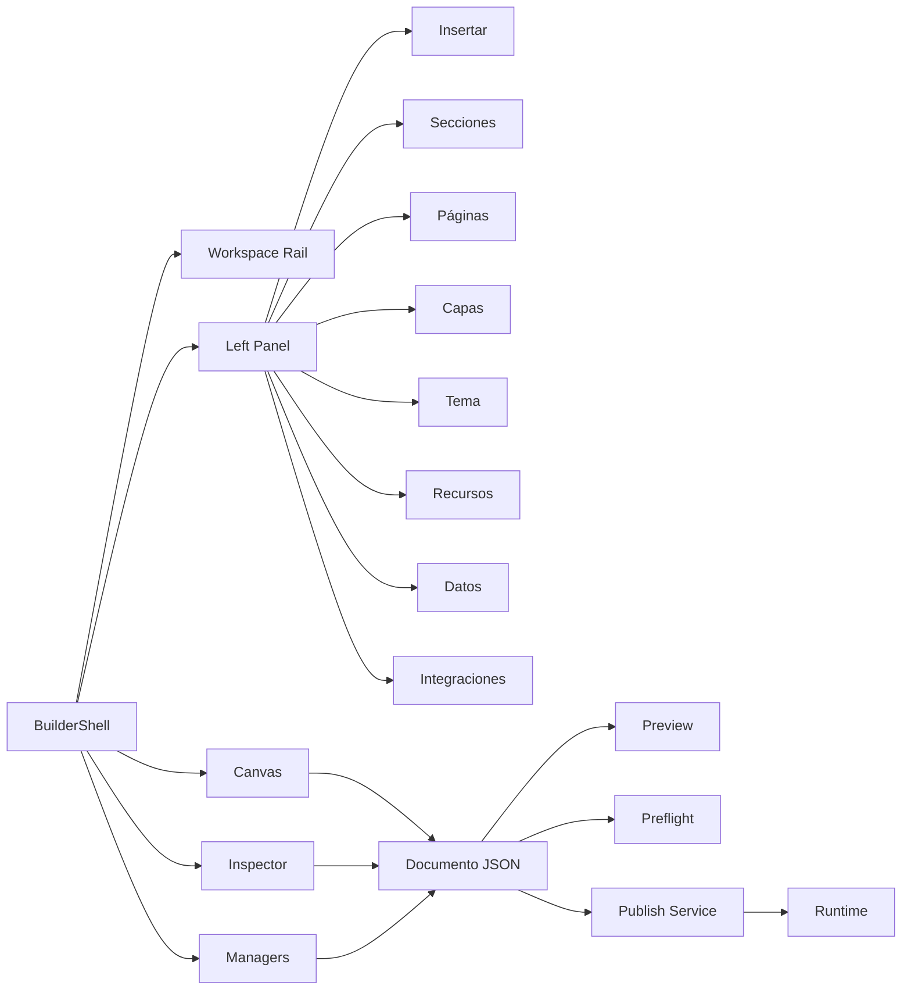
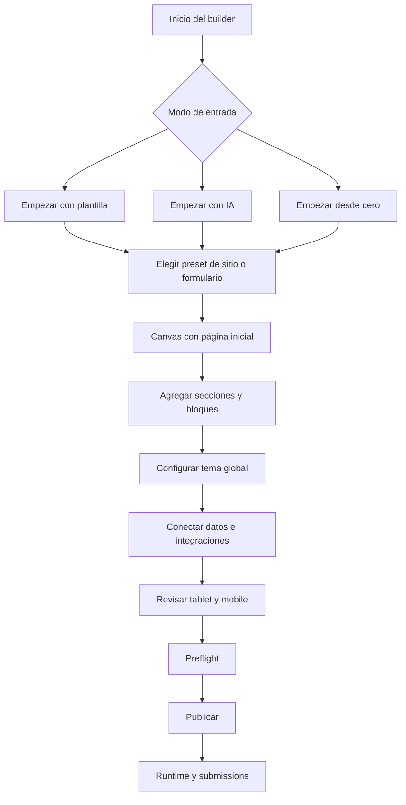
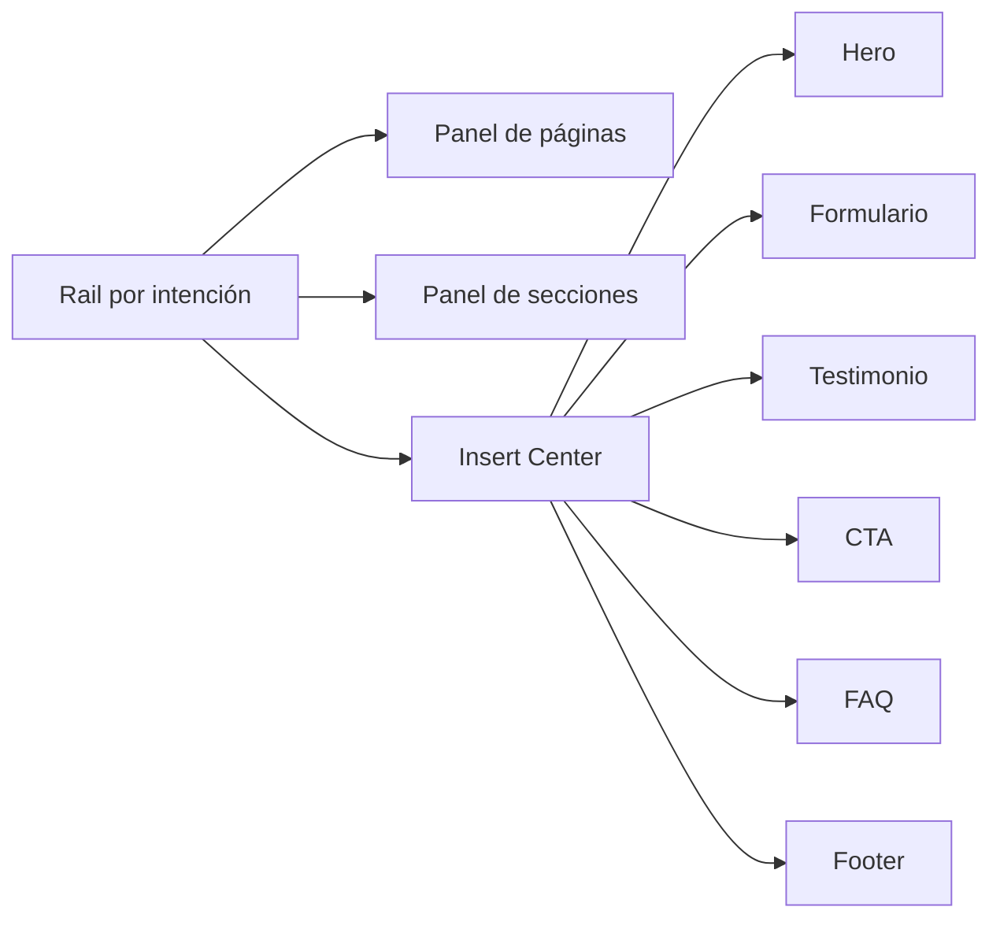
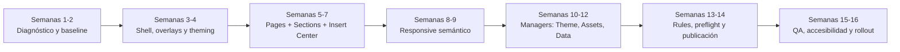

# Investigación UX y arquitectura para Dynamic Forms

## Alcance y supuestos

El objetivo de esta investigación es definir cómo evolucionar **dynamic_forms** desde un constructor centrado en formularios hacia un **builder capaz de crear formularios, páginas y sitios web**, mejorando visualización, interacción y arquitectura sin perder su condición de producto **standalone** y desacoplado del consumidor empresarial. La documentación interna subida a la conversación confirma precisamente esa restricción y, además, establece como principio rector que no conviene ampliar el catálogo visual antes de consolidar el contrato entre editor, esquema, preview, publicación y runtime. fileciteturn8file0 fileciteturn11file6

También quedan dos supuestos explícitos del encargo: todavía **no se había especificado el formato preferido de entrega** y, por tanto, las opciones razonables siguen siendo **HTML** para revisión colaborativa y **PDF** para distribución ejecutiva; además, aunque se subieron dos ZIP llamados `imagenes_dynamic_forms(2).zip` y `imagenes_wix(3).zip`, en esta sesión **no fue posible extraer programáticamente su inventario interno de imágenes**, por lo que el catálogo exhaustivo por archivo individual queda marcado como **“no especificado”** allí donde no existe verificación directa. En consecuencia, el análisis visual comparativo se apoya en tres fuentes complementarias: nombres de los ZIP, documentación/código del producto actual y benchmarking oficial de Wix y otras plataformas comparables. 

En la documentación interna sí quedó verificado que el producto actual usa un workspace compuesto por **topbar, rail, drawer, canvas, inspector, bottom panel y managers flotantes**, con separación entre `workspaceViewport` y `canvasDeviceMode`, un Insert Center todavía MVP, inspector schema-driven, Form Manager, Rule Manager, adapters local/REST y smoke tests básicos para apertura, inserción, drag and drop, preview y auditoría responsive. También se documenta que **Pages, Layers, Theme, Data e Integrations** siguen teniendo madurez parcial. fileciteturn9file0 fileciteturn9file13

## Resumen ejecutivo

La conclusión principal es clara: **dynamic_forms no necesita parecerse a Wix en todo; necesita adoptar la estructura mental que hace que Wix, Squarespace, Framer o Webflow se sientan como “constructores de experiencias” y no solo como editores de campos**. En el estado actual, dynamic_forms ya tiene piezas importantes de un estudio de edición serio —canvas, inspector, rail, paneles, managers, drag overlays, focus ring, reduced motion y una base de schema/layout consistente—, pero todavía enfrenta tres límites: poca profundidad en navegación por intención, insuficiente madurez de los managers de páginas/tema/datos/integraciones y una prioridad arquitectónica pendiente entre schema, reglas, preview, publicación y runtime. fileciteturn9file0 fileciteturn9file3 fileciteturn9file15

Wix, en su oferta oficial en español, se posiciona como un creador híbrido donde el usuario puede empezar por IA, por plantilla o desde cero, con **más de 900 plantillas**, edición de **arrastrar y soltar** con precisión de píxel, **landing pages**, vista móvil editable, paneles de negocio, SEO, CRM, reservas y una biblioteca amplia de recursos y animaciones. Squarespace comunica un patrón parecido, pero con un tono más curado: IA + plantillas + drag and drop + páginas prediseñadas + marketing integrado. Webflow y Framer, por su parte, empujan un modelo más “sistema de diseño/CMS first”, donde las páginas y los componentes reutilizables son ciudadanos de primera clase. Typeform y Jotform muestran la otra mitad del problema: cómo convertir el formulario en experiencia, lógica conversacional, automatización y extensión hacia landing pages o apps. citeturn16view0turn18view0turn18view1turn18view2turn18view3turn17view0turn17view1turn17view2turn5view0turn5view2turn15view0turn15view1turn15view2turn15view3

La implicación estratégica es que **dynamic_forms debe reposicionarse como “Dynamic Builder Studio”** con un modelo de documento jerárquico: páginas, secciones, contenedores, grupos, campos, contenido, acciones, media, reglas y datos. La documentación interna ya camina en esa dirección: propone una experiencia final con topbar compacta, rail por intención, panel izquierdo invocable, canvas jerárquico, inspector contextual, managers especializados, preview fiel y workspaces de settings/submissions; además, el modelo de nodos contempla layout con `absolute`, `flow`, `grid` y `flex`, responsive por breakpoint, rules, bindings, acciones y accesibilidad. fileciteturn11file6 fileciteturn11file18 fileciteturn10file15

La decisión de producto más importante no es “agregar más widgets”, sino **reordenar la experiencia**. Hoy, el producto parece tener la base de un editor técnico; la mejora debe convertirlo en un **estudio visual**. Eso implica: inicio por objetivo, panel de páginas y secciones antes que lista de campos, presets de bloques, responsive semántico, gestor de tema, gestor de assets, estados de publicación visibles, microinteracciones más claras y un runtime de reglas real antes de escalar la promesa de sitios completos. La propia documentación interna ya lo sugiere: “el canvas manda; los paneles asisten”. fileciteturn11file6

## Metodología y estado actual del producto

La metodología pedida tiene sentido y conviene conservarla como estándar operativo del proyecto, incluso aunque en esta sesión no se haya podido ejecutar completa sobre el contenido de los ZIP. El proceso recomendado consta de cuatro tramos: **descompresión**, **catalogación**, **etiquetado** y **comparación**. La catalogación debe registrar nombre de archivo, peso, resolución, tipo de captura, familia UI, patrones visuales y variantes; el etiquetado debe ser mixto, con heurísticas automáticas para detectar paneles, barras, modales, canvas, cards, grids y estados, y revisión manual para corregir ambigüedades; la comparación debe medir consistencia de UI, jerarquía visual, densidad informativa, contraste, legibilidad, claridad de estados, escalabilidad responsive y alineación WCAG. 

Ese enfoque encaja bien con el estado documentado del producto. La base interna ya ofrece un ecosistema compatible con una evolución a builder visual más serio: React 19, Vite 8, Tailwind 4, `@dnd-kit/core`, smoke tests, baseline visual con Playwright y un shell de edición desacoplado. También se confirma que la auditoría responsive actual existe, pero todavía se centra en el breakpoint detectado y en variantes del inspector/drawer más que en el reflow real de todos los componentes o en errores de overflow horizontal, foco atrapado, DnD inválido, publicación end-to-end y documentos grandes. fileciteturn8file0 fileciteturn9file0

A nivel visual, la documentación interna detecta fortalezas y riesgos muy concretos. Entre lo positivo: un solo CSS global, tokens, sombras, radios, tamaños del workspace, scrollbars, focus ring y soporte a `prefers-reduced-motion`. Entre lo problemático: el fondo radial aplicado al `body`, el `color-scheme: light` forzado y una escala de z-index incompleta que todavía no contempla explícitamente `canvasOverlay`, `dragOverlay`, `backdrop`, `popover`, `contextMenu`, `tooltip`, `bottomSheet`, `toast` o `commandPalette`. Eso importa mucho para un builder que quiere pasar de “editor de formularios” a “editor de páginas”, porque la superposición de capas, menus y ayudas contextuales deja de ser un detalle de CSS y se vuelve parte crítica de la experiencia de autoría. fileciteturn9file15

También resulta relevante que el modelo recomendado por la documentación interna ya contempla **páginas**, **nodos jerárquicos**, **reglas**, **assets** y **dataSources**, junto con categorías de catálogo como `primitive`, `variantPreset`, `treePreset`, `managedBlock`, `integration`, `reusableReference`, `managerLauncher` y `overlay`. Es decir: la arquitectura conceptual ya está más cerca de un **site builder modular** que de un simple constructor plano de campos. Lo que falta no es tanto inventar el modelo, sino completar la relación entre navegación, presets, runtime, publicación y gestores especializados. fileciteturn11file18 fileciteturn10file15

En accesibilidad, las recomendaciones de este informe se apoyan en estándares primarios. W3C recomienda usar **WCAG 2.2** como referencia vigente; el criterio 1.4.3 exige una relación de contraste mínima de **4.5:1** para texto normal y **3:1** para texto grande; el criterio 2.4.7 exige un **indicador visible de foco** para toda interfaz operable por teclado; el criterio 2.5.8 fija un tamaño mínimo de objetivo táctil/puntero de **24 × 24 CSS px** o, alternativamente, suficiente espaciado; y `prefers-reduced-motion` debe respetar la preferencia del usuario para reducir o reemplazar animaciones no esenciales. citeturn11view0turn13view0turn13view2turn19view0turn12view0

## Catálogo verificable y análisis comparativo entre ZIP A y ZIP B

### Catálogo verificable del material recibido

La siguiente tabla refleja **lo verificable de forma directa en esta sesión**. Dado que no se pudo descomprimir ni enumerar el contenido interno de ambos ZIP, los campos exigidos por imagen individual se marcan como **“no especificado”** cuando no existe evidencia verificable.

| Conjunto | Archivo recibido | Tamaño | Resolución | Tipo de componente UI | Etiquetas visuales | Número de variantes | Estado de verificación |
|---|---|---:|---:|---|---|---:|---|
| ZIP A | `imagenes_dynamic_forms(2).zip` | no especificado | no especificado | no especificado | no especificado | no especificado | Recibido, pero sin extracción interna verificable |
| ZIP B | `imagenes_wix(3).zip` | no especificado | no especificado | no especificado | no especificado | no especificado | Recibido, pero sin extracción interna verificable |

### Catálogo funcional inferido por componente

Aunque el inventario por imagen no quedó accesible, sí es posible construir un **catálogo funcional inferido** de los componentes relevantes para comparar ambos conjuntos, usando el nombre de los ZIP, la documentación actual de dynamic_forms y las superficies oficiales de Wix. Esta tabla es útil para orientar el rediseño porque organiza el análisis por **familia de componente**, que es como debe evolucionar el sistema de diseño del producto.

| Componente | ZIP A dinámico_forms | ZIP B Wix | Lectura UX |
|---|---|---|---|
| Topbar / barra principal | Confirmada en docs como parte del workspace. fileciteturn9file0 | Wix usa entrada clara a edición, publicación y paneles de negocio. citeturn16view0turn18view2 | Dynamic Forms debe convertir la topbar en barra de intención: documento, página, preview, publicar, estado y device mode |
| Rail lateral | Confirmado: rail + drawer + paneles. fileciteturn9file0 | Wix expone biblioteca, negocio, SEO, marketing y mobile view. citeturn16view0turn18view0turn18view2 | El rail actual debe pasar de “herramientas técnicas” a “navegación por objetivo” |
| Canvas | Confirmado y ya central en la visión objetivo interna. fileciteturn11file6 | Wix enfatiza canvas fluido y edición pixel-perfect. citeturn18view0 | El canvas debe ser el centro visual y el contexto primario de edición |
| Inspector | Confirmado y schema-driven. fileciteturn9file0 | Wix es menos “form-heavy” y más progresivo/contextual. citeturn18view0turn16view0 | El inspector debe volverse más progresivo y menos denso por defecto |
| Insert / Add panel | Insert Center aún MVP. fileciteturn9file0 | Wix muestra biblioteca amplia de componentes, gráficos y animaciones. citeturn16view0turn18view0 | Insertar debe reorganizarse por bloques, secciones y presets, no solo por controles |
| Páginas | Parcial: Pages requiere mayor densidad y profundidad. fileciteturn9file0 | Wix crea sitios completos, landing pages y múltiples páginas. citeturn18view3turn16view0 | Pages no puede seguir siendo secundaria; debe ser un primer espacio de navegación |
| Tema / branding | Parcial: Theme requiere profundidad. fileciteturn9file0 | Wix propaga tipografías, colores y estilos por el sitio. citeturn16view0turn18view0 | Theme Manager debe ser global, no solo propiedades dispersas |
| Datos / reglas | Rule Manager existe, pero el runtime de reglas aún se documenta como hueco de prioridad. fileciteturn9file0 fileciteturn9file15 | Wix y competidores conectan negocio, CRM, reservas, analytics y SEO. citeturn18view2turn16view0 | Expandir a “sitios” sin motor de reglas y data sólido generaría deuda rápida |
| Responsive | Auditoría actual limitada; docs piden responsive semántico. fileciteturn10file1 fileciteturn11file5 | Wix permite revisar y ajustar vista móvil; Squarespace y Elementor también lo priorizan. citeturn18view2turn17view0turn14view2 | El responsive debe estar modelado a nivel de documento y no solo de viewport |
| Estados / overlays | Hay drag overlay y feature flags de guías, grid y snapping; z-index todavía incompleto. fileciteturn9file2 fileciteturn9file3 fileciteturn9file15 | Wix comunica feedback de generación y de adición contextual. citeturn16view0turn18view0 | Hace falta un sistema coherente de overlays, estados y feedback contextual |

### Similitudes y diferencias por componente

La diferencia central entre ZIP A y ZIP B no es cosmética; es **de modelo mental**. Dynamic_forms, según la evidencia interna, ya tiene un editor serio pero orientado a documento/formulario. Wix, según su producto oficial, opera como un **orquestador de creación web completa**: IA, plantillas, canvas libre, páginas, negocios, mobile view, SEO, CRM, marketing y dashboard. Donde dynamic_forms hoy muestra superficies parciales —Pages, Theme, Data, Integrations— Wix muestra cadenas de valor completas y conectadas. fileciteturn9file0 citeturn16view0turn18view0turn18view2

La similitud importante es que ambos comparten una base útil para converger: canvas visual, componentes editables, paneles laterales, posibilidades de drag and drop y personalización. La diferencia importante es que en Wix el usuario percibe inmediatamente que puede construir **sitios**; en dynamic_forms, por la documentación disponible, todavía se percibe principalmente que puede construir **formularios con superficies adicionales**. Esa es exactamente la brecha UX que conviene cerrar. fileciteturn11file6 citeturn18view0turn17view0turn5view0

## Benchmarking oficial de competidores

### Comparativa estratégica

| Competidor | Posicionamiento oficial | Fortalezas relevantes para Dynamic Forms | Riesgos si se copia sin filtro | Fuente oficial |
|---|---|---|---|---|
| Wix | Creador híbrido con IA, plantillas, drag and drop, landing pages, móvil, SEO, CRM y panel de negocio. | Excelente modelo de “de idea a sitio publicado”, biblioteca amplia, vista móvil editable, integración de negocio. | Puede llevar a sobrecargar el producto con módulos comerciales antes de madurar schema/runtime. | citeturn16view0turn18view0turn18view1turn18view2turn18view3 |
| Squarespace | Editor más curado: IA + plantillas + drag and drop + páginas y funciones + marketing. | Muy buen patrón para páginas prediseñadas, bloques curados y flujo simple de publicación. | Riesgo de quedarse en una experiencia “bonita pero rígida” si no se conserva la flexibilidad del canvas. | citeturn17view0turn17view1turn17view2 |
| Webflow | Plataforma visual para sitios/pages con CMS componible, reusable components y herramientas para marketing. | Excelente referencia para componentes reutilizables, CMS visual y page building serio. | Exceso de complejidad si se traslada su gramática completa a usuarios de negocio. | citeturn5view0turn4view3turn4view5 |
| Framer | Builder profesional con CMS conectado al canvas, SEO, rendimiento fuerte y colaboración. | Gran inspiración para sincronía entre contenido y canvas, publishing, previews sociales y performance. | Riesgo de priorizar estética/motion sin cerrar antes reglas, datos y contratos internos. | citeturn5view2turn14view0 |
| Typeform | Plataforma de formularios conversacionales con automatización, analytics y landing page builder. | Muy fuerte para formularios adaptativos, experiencia conversacional y analítica de drop-off. | Si se extrapola demasiado, puede empujar el producto hacia flujos lineales y no hacia páginas jerárquicas. | citeturn8view0turn15view0turn15view1 |
| Jotform | Constructor no-code de formularios con lógica condicional, pagos, integraciones y extensiones como Apps. | Referencia fuerte para ecosistema alrededor del formulario: apps, pagos, workflows e integraciones. | Riesgo de derivar hacia “suite utilitaria” sin una experiencia de builder visual coherente. | citeturn15view2turn15view3turn15view4 |

### Patrones que conviene absorber

El patrón más valioso del benchmark es la **entrada por intención**. Wix y Squarespace no obligan al usuario a pensar primero en el control UI; le dejan pensar en el resultado: sitio, landing, tienda, blog, portafolio, cita, reserva, campaña o formulario. Dynamic_forms debería absorber exactamente esa lógica y reorganizar su rail, Insert Center y catálogo alrededor de **página, sección, formulario, contenido, acción, media, datos, integraciones y publicación**. citeturn16view0turn17view1turn5view0

El segundo patrón es la **progresividad del editor**. Webflow y Framer reservan más densidad técnica para situaciones donde el usuario ya está dentro del ciclo de edición. No saturan el lienzo desde el minuto uno. Dynamic_forms debería heredar eso: paneles compactos, inspector progresivo, gestores especializados en overlays o drawers grandes y una topbar corta, con estados visibles de guardado, preview y publicación. citeturn5view0turn5view2 fileciteturn11file6

El tercer patrón es la **coherencia entre canvas y sistema de contenido**. Framer conecta CMS y canvas; Webflow une CMS visual y page building; Typeform y Jotform extienden el formulario hacia automatización, landing y apps. Para Dynamic Forms, eso se traduce en una idea muy concreta: **no separar el documento visual del documento de datos**. Páginas, nodos, reglas, datos y assets deben vivir dentro de un único documento versionado, con publicación consistente y preview fiel. citeturn5view0turn5view2turn15view0turn15view3 fileciteturn11file18

## Recomendaciones de UX, navegación, arquitectura y ejemplos

### Lista priorizada de cambios

| Tipo | Cambio recomendado | Prioridad | Razonamiento | Esfuerzo |
|---|---|---|---|---|
| Modificar | Reposicionar el producto como **studio** y no como simple form builder | Alta | Cambia la percepción del producto y ordena todo lo demás | Media |
| Modificar | Convertir **Pages** en un panel de primer nivel con sitemap, slugs y estados | Alta | Sin páginas de primer nivel no hay arquitectura real de sitio | Alta |
| Modificar | Rediseñar **Insert Center** por intención: secciones, formularios, contenido, media, CTA, data | Alta | Hoy el Insert Center se documenta como MVP; debe pasar a ser motor de creación | Alta |
| Añadir | Biblioteca de **bloques/presets**: hero, two-column, FAQ, pricing, testimonial, contact, lead form | Alta | Es la forma más rápida de pasar de formulario a página/sitio | Alta |
| Modificar | Hacer el **inspector contextual y progresivo** | Alta | Menos fricción inicial, más profundidad cuando hace falta | Media |
| Añadir | **Theme Manager** real: color, tipografía, radio, spacing, botones, campos, superficies | Alta | Wix y Squarespace muestran que la marca debe propagarse globalmente | Media |
| Añadir | **Asset Manager** y media panel de primer nivel | Alta | Sitios y landing pages viven de media, no solo de campos | Alta |
| Modificar | Diseñar un **responsive semántico** por documento y componente | Alta | La documentación ya pide separar viewport del canvas/device mode | Alta |
| Modificar | Completar el **runtime de reglas** antes de escalar la promesa del producto | Alta | La documentación interna identifica este punto como estructural | Alta |
| Eliminar | Fondo radial global en `body` y modo claro forzado | Media | Rompe embebibilidad y flexibilidad temática | Baja |
| Modificar | Formalizar sistema de **overlays/z-index** | Media | Imprescindible para menu, popover, drag overlays, command palette y toasts | Media |
| Añadir | **Preflight** visible con checklist de accesibilidad, responsive y publicación | Media | Hace tangible la calidad antes de publicar | Media |
| Añadir | Historial, clipboard, autosave y versionado visibles en UI | Media | Mejoran confianza y control del editor | Alta |
| Añadir | **Data Manager** e **Integrations Manager** con resúmenes compactos + modal avanzado | Media | Evita inflar el inspector | Alta |
| Eliminar | Campos y acciones “huérfanos” expuestos sin narrativa de uso | Media | El catálogo debe hablar en bloques y resultados, no en widgets aislados | Baja |

### Navegación, layout responsive, accesibilidad y microinteracciones

La navegación recomendada es una combinación de **rail por intención + panel izquierdo invocable + inspector contextual + managers especializados**. Esa dirección coincide con la visión interna ya documentada y es consistente con la forma en que Wix, Squarespace y Webflow distribuyen complejidad. El rail debería contener: **Insertar, Secciones, Páginas, Capas, Tema, Recursos, Datos, Integraciones, Preview y Publicar**. El panel izquierdo no debe intentar mostrarlo todo a la vez; debe actuar como superficie especializada. fileciteturn11file6 citeturn16view0turn17view1turn5view0

En responsive, la recomendación no es “apilar todo” sino distinguir entre **responsive de aplicación** y **responsive de documento**, algo que la documentación interna ya destaca. En desktop, conviene usar layout de tres zonas: rail + panel + canvas + inspector. En tablet, el inspector debe pasar a overlay lateral y el panel izquierdo debe ocupar ancho variable. En móvil, el canvas debe entrar en **focus mode**, con rail reducido, bottom sheet para inspector y edición por bloques, no por propiedades avanzadas. Las propias reglas internas sugeridas ya apuntan a que en móvil los `Field` vayan a `width: 100%`, altura mínima suficiente y los `Heading` usen `clamp` y `overflow-wrap`. fileciteturn9file0 fileciteturn11file5

En accesibilidad, hay cuatro mínimos no negociables. Primero, contraste AA: **4.5:1** para texto normal y **3:1** para texto grande. Segundo, **foco visible** en todos los elementos operables por teclado. Tercero, targets de al menos **24 × 24 CSS px**, idealmente más generosos en móvil y en controles críticos. Cuarto, respeto a `prefers-reduced-motion`, reduciendo animaciones no esenciales o sustituyéndolas por transiciones de opacidad. Dynamic_forms ya tiene foco y reduced motion documentados, lo cual es una buena base. citeturn13view0turn13view2turn19view0turn12view0 fileciteturn9file15

Las microinteracciones deben ayudar al entendimiento, no decorar. Para este producto, convienen especialmente estas: halo de selección consistente; drop zones con estados **válido/invalidado**; toast discreto de guardado; badge persistente de draft/no publicado; breadcrumb de página/sección; indicador de foco en canvas; skeleton breve al cargar presets; confirmación optimista al publicar; y modo reducido de motion que reemplace desplazamientos grandes por disoluciones breves. Esta lógica encaja tanto con las guías WCAG y MDN como con las prácticas observables en productos como Wix, Framer y Typeform. citeturn12view0turn13view2turn18view0turn14view0turn15view1

### Arquitectura de componentes recomendada

La arquitectura recomendada debe separar con disciplina **superficies de navegación**, **superficies de edición** y **servicios de dominio**, un principio que aparece explícitamente en la documentación interna. Eso evitará que el inspector, el catálogo o los managers absorban lógica de reglas, bindings o red de publicación. El documento central debe seguir siendo un **BuilderDocument JSON versionado** con `pages`, `nodes`, `rules`, `assets` y `dataSources`, y no JSX o HTML final. fileciteturn11file7 fileciteturn11file18 fileciteturn11file6

La estructura de componentes debería parecerse a esto:

| Capa | Responsabilidad | Qué debe evitar |
|---|---|---|
| `BuilderShell` | Orquestar layout, paneles y estado global de workspace | Lógica de negocio por componente |
| `WorkspaceRail` | Navegación por intención | Contener formularios complejos |
| `WorkspaceDrawer` | Superficies grandes: páginas, secciones, presets, recursos | Duplicar el inspector |
| `Canvas` | Edición visual, selección, drop zones, overlays y focus mode | Resolver datos/red/publicación |
| `Inspector` | Configuración contextual de nodo seleccionado | Ejecutar reglas o integraciones directamente |
| `Managers` | Flujos especializados: form, rules, theme, assets, data | Vivir permanentemente abiertos |
| `Registry` | Definición de primitives, presets, blocks y overlays | Lógica visual embebida de consumidor específico |
| `Adapters` | Persistencia, publicación, runtime, fuentes de datos | Mezclarse con render visual |
| `Runtime` | Render del documento publicado y evaluación de reglas | Incorporar dependencias de editor |

Ese modelo además encaja con el tipo de nodo ya documentado internamente, donde `layout.mode` contempla `absolute`, `flow`, `grid` y `flex`, y donde cada nodo puede incorporar `binding`, `validation`, `ruleIds` y `actionIds`. La oportunidad de UX está en hacer visible esa potencia sin obligar al usuario a entenderla toda desde el principio. fileciteturn10file15 fileciteturn11file0

### Wireframes y flujos sugeridos

Como ejemplos visuales de referencia oficial, las superficies más útiles para estudiar son: la portada/editor híbrido y biblioteca de componentes de Wix, el constructor de páginas y bloques de Squarespace, el page building con CMS visual de Webflow, el CMS conectado al canvas y SEO en Framer, y la lógica conversacional/adaptativa de Typeform y Jotform. citeturn16view0turn17view0turn5view0turn5view2turn8view0turn8view1

## Plan de implementación y roadmap

La documentación interna ya propone un roadmap general de **12 a 16 semanas** con fases de diagnóstico, fundamentos de workspace, sistema visual, canvas, responsive, inspector, managers, Insert Center, páginas/reglas, preview/publicación, backend/integraciones y QA. Esa secuencia es sólida y conviene conservarla, pero con un ajuste táctico: la expansión hacia “sitios” debe empezar en UX y navegación, pero **no debe adelantarse al cierre del modelo de documento y del runtime de reglas**. fileciteturn10file1 fileciteturn10file15

### Roadmap recomendado

| Tramo | Objetivo | Resultado esperado | Esfuerzo |
|---|---|---|---|
| Diagnóstico | Baseline visual, descompresión reproducible, inventario de superficies y mapa del estado | Catálogo real de ZIP, baseline Playwright, matriz de componentes | Media |
| Fundamentos | Limpiar shell, overlays, z-index, theming global y estado de workspace | Builder más estable y embebible | Media |
| Navegación | Rail por intención, panel de páginas, secciones e Insert Center rediseñado | Cambio perceptivo de “form builder” a “studio” | Alta |
| Sistema de bloques | Presets de hero, section, form block, CTA, FAQ, testimonial y footer | Aceleración de creación de páginas/sitios | Alta |
| Responsive | Breakpoints semánticos, mobile focus mode y reglas por componente | Páginas realmente editables en desktop/tablet/mobile | Alta |
| Profundidad funcional | Theme Manager, Asset Manager, Data Manager, Integrations Manager | Builder escalable y menos dependiente del inspector | Alta |
| Runtime y publicación | Reglas reales, preflight, preview fiel y publicación consistente | Sitios y formularios publicables con confianza | Alta |
| Calidad | E2E, visual regression, accesibilidad, rendimiento y documentos grandes | Menos deuda al crecer catálogo y flujos | Media |

### Cronología sugerida

### Criterio de priorización por recomendación

| Recomendación | Dependencia crítica | Riesgo si se pospone | Esfuerzo |
|---|---|---|---|
| Panel de páginas + sitemap | Estado de documento | El producto seguirá percibiéndose como editor de formularios | Alta |
| Insert Center por intención | Registry y catálogo | El crecimiento de componentes seguirá desordenado | Alta |
| Theme Manager | Tokens y primitives | Branding inconsistente y trabajo repetitivo | Media |
| Asset Manager | Publicación y storage | Sitios pobres en media o media dispersa | Alta |
| Responsive semántico | Layout por nodo | Mala experiencia tablet/mobile y más bugs de overflow | Alta |
| Z-index y overlays | Shell y CSS base | Menús, popovers y DnD poco fiables | Media |
| Runtime de reglas real | Backend + preview + runtime | Sitios/formularios dinámicos poco confiables | Alta |
| Preflight + publish UX | Publicación | Más errores al pasar de edición a producción | Media |
| Accesibilidad sistemática | Design system | Deuda técnica acumulativa y problemas de usabilidad | Media |
| Baseline visual automatizado | QA | Cada mejora visual puede romper el editor silenciosamente | Baja |

La recomendación final de implementación es **empezar por la estructura de experiencia y no por el detalle gráfico**. Si se intenta embellecer antes de ordenar Pages, Sections, Insert Center, Theme y publicación, Dynamic Forms solo obtendrá una interfaz más pulida para una promesa todavía incompleta. En cambio, si se siguen el orden y los principios ya sugeridos por la documentación interna —schema como fuente de verdad, core desacoplado, canvas central y paneles asistentes—, el producto puede evolucionar de forma creíble hacia un constructor de formularios, páginas y sitios web con una base más robusta y más fácil de mantener. fileciteturn11file6 fileciteturn10file15