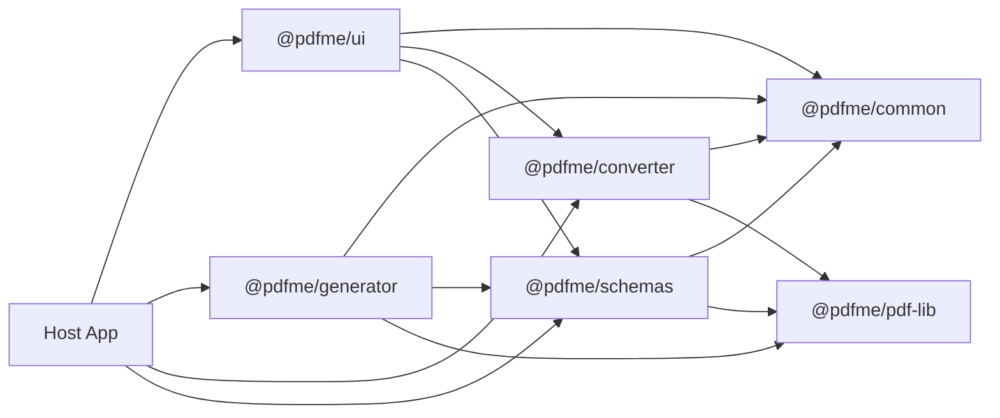
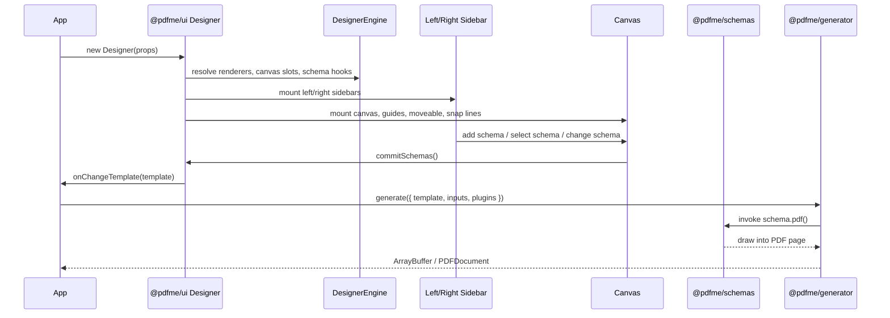
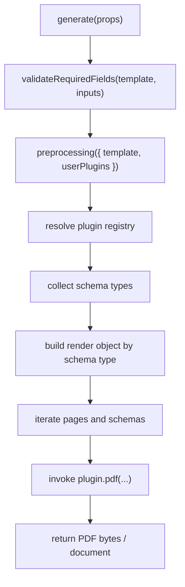

# PDFME Vendor Technical Guide

> Premium internal technical guide for the vendorized `pdfme` workspace mounted under `vendors/pdfme/*`.

---

## Executive Summary

This document explains the current **vendorized `pdfme` architecture** used inside this repository and serves as the operational guide for engineers who need to:

- integrate the vendor packages into the host application
- extend behavior without breaking the runtime
- replace selected UI layers safely
- understand where customization is supported
- maintain the fork without reverse engineering the source every time

This guide is written against the fork currently mounted under:

```txt
vendors/pdfme/*
```

It reflects the current refactors and customization points already present in the workspace, including:

- composable `Designer` parts
- detached left and right sidebars
- `DesignerEngineBuilder`
- schema metadata and schema plugin composition
- document thumbnails rail in the right sidebar

---

## Document Scope

The guide covers the following workspace packages:

- `@pdfme/common`
- `@pdfme/converter`
- `@pdfme/generator`
- `@pdfme/schemas`
- `@pdfme/ui`

It also documents the main runtime relationships between the host application and the vendor workspace.

### Intended audience

This document is for:

- frontend engineers integrating the designer
- engineers extending field catalogs or schema behavior
- developers customizing sidebars or canvas behavior
- maintainers responsible for upgrades and compatibility
- architects defining extension boundaries for the fork

### Non-goals

This guide does **not** attempt to document every internal implementation detail line by line.  
Instead, it focuses on the most useful and stable operational seams:

- public exports
- runtime bridges
- builder-based composition
- schema metadata
- generator flow
- safe vs risky extension points

---

## Table of Contents

- [1. Workspace topology](#1-workspace-topology)
- [2. Architectural principles](#2-architectural-principles)
- [3. Package responsibilities](#3-package-responsibilities)
- [4. End-to-end runtime flow](#4-end-to-end-runtime-flow)
- [5. Public UI API](#5-public-ui-api)
- [6. DesignerRuntimeApi](#6-designerruntimeapi)
- [7. DesignerEngineBuilder](#7-designerenginebuilder)
- [8. Reusable Designer components](#8-reusable-designer-components)
- [9. Sidebar base contracts](#9-sidebar-base-contracts)
- [10. Schema system](#10-schema-system)
- [11. Generator layer](#11-generator-layer)
- [12. Converter layer](#12-converter-layer)
- [13. Common layer](#13-common-layer)
- [14. Recommended integration patterns](#14-recommended-integration-patterns)
- [15. Example integrations](#15-example-integrations)
- [16. Extension boundaries](#16-extension-boundaries)
- [17. Maintenance checklist](#17-maintenance-checklist)
- [18. Related files](#18-related-files)

---

# 1. Workspace topology



## Important note

This repository uses **workspace packages**, not only published npm packages.

### Workspace configuration

The root `package.json` declares:

```json
{
  "workspaces": ["vendors/pdfme/*"]
}
```

The root dependencies also use `workspace:*` for the vendor packages:

- `@pdfme/common`
- `@pdfme/ui`
- `@pdfme/schemas`
- `@pdfme/generator`
- `@pdfme/converter`
- `@pdfme/pdf-lib`

### Operational implication

The code under `vendors/pdfme/*` is the **actual source of truth** for application behavior.

That means:

- upstream package docs may not match the current runtime exactly
- internal changes inside the workspace can directly affect the host app
- all integrations should be validated against the local vendor source, not only the upstream mental model

---

# 2. Architectural principles

The current fork follows a few practical design principles that are important for maintainers.

## 2.1 Workspace-first execution model

The host application does not consume a purely external library model.  
Instead, it consumes a **local workspace implementation**.

This changes how upgrades and debugging must be approached:

- package boundaries still matter
- but internal contracts between workspace packages are equally important
- breaking changes can happen even when the public API looks stable

## 2.2 Builder-based composition over deep rewrites

The preferred customization model is:

- use `DesignerEngineBuilder`
- replace renderers and slot components
- store extra metadata through supported schema config APIs
- avoid patching orchestration internals unless a deeper fork is intentional

## 2.3 Schema-centric extensibility

A large part of the system is organized around schema plugins:

- design-time representation
- runtime UI behavior
- prop panel configuration
- PDF rendering behavior

This makes schema plugins one of the most important long-term extension seams.

## 2.4 Separation between UI editing and PDF generation

The designer and generator are related but distinct layers.

A field can appear valid in the designer and still fail or differ during PDF generation if:

- `plugin.ui()` and `plugin.pdf()` diverge
- runtime metadata is incomplete
- schema default values do not match generator expectations
- environment-specific conversion behavior differs

---

# 3. Package responsibilities

## `@pdfme/common`

### Role

Core contracts and shared helpers.

### Main responsibilities

- schema types and template contracts
- unit conversion (`mm2pt`, `pt2mm`, `px2mm`, etc.)
- template validation
- plugin registry
- UI and generator props typing
- runtime helper functions used across UI and generation

### Primary entrypoint

```ts
vendors/pdfme/common/src/index.ts
```

### Why it matters

This package is the most important place to understand **cross-package contracts**.  
If multiple layers disagree on structure or typing, this package is often the first place to inspect.

---

## `@pdfme/schemas`

### Role

Schema plugin layer.

### Main responsibilities

- each schema exports a `Plugin<TSchema>`
- provides `pdf`, `ui`, `propPanel`, `icon`
- supports metadata composition through `createSchemaPlugin`

### Primary entrypoint

```ts
vendors/pdfme/schemas/src/index.ts
```

### Why it matters

This layer controls how fields are declared, registered, categorized, and exposed to the rest of the system.

It is also the most relevant package when implementing:

- custom field catalogs
- schema metadata
- grouped plugins
- field-level capabilities

---

## `@pdfme/generator`

### Role

PDF generation layer.

### Main responsibilities

- consumes `Template`
- resolves plugins
- renders schema content into PDF pages

### Primary entrypoint

```ts
vendors/pdfme/generator/src/index.ts
```

### Why it matters

This layer is responsible for turning the template model into a final document.  
When final PDF behavior differs from what the designer shows, this package is usually where the root cause lives.

---

## `@pdfme/converter`

### Role

Document conversion utilities.

### Main responsibilities

- PDF → image
- PDF → size metadata
- image → PDF

### Primary entrypoints

```ts
vendors/pdfme/converter/src/index.browser.ts
vendors/pdfme/converter/src/index.node.ts
```

### Why it matters

This package is environment-sensitive.  
Browser and Node behavior are intentionally separated, especially around worker loading and rendering dependencies.

---

## `@pdfme/ui`

### Role

Interactive UI runtime.

### Main responsibilities

- `Designer`
- `Viewer`
- `Form`
- canvas interaction
- left sidebar field catalog
- right sidebar list, detail and documents rail
- runtime API bridge
- engine builder for composition

### Primary entrypoint

```ts
vendors/pdfme/ui/src/index.ts
```

### Why it matters

This is the main operational layer for host-app integration.  
If a team is embedding the designer or customizing its shell, this package is usually the primary integration surface.

---

# 4. End-to-end runtime flow



## Runtime interpretation

1. The host app instantiates `Designer`.
2. The designer resolves its composition engine and runtime bridges.
3. The sidebars and canvas share state through the designer runtime.
4. User actions mutate schemas and commit template changes.
5. The host app receives template updates through callbacks.
6. The host app invokes the generator with template, inputs and plugins.
7. The generator resolves plugins and executes `schema.pdf()` per field.
8. The output is returned as bytes or a document object.

## Key observation

The runtime has two closely related but separate flows:

- **editing flow** in `@pdfme/ui`
- **rendering flow** in `@pdfme/generator`

Understanding both flows is essential when debugging field behavior.

---

# 5. Public UI API

## 5.1 Main exports

From:

```ts
vendors/pdfme/ui/src/index.ts
```

### Public exports

- `Designer`
- `Viewer`
- `Form`
- `DesignerEngineBuilder`
- all exports from `components/Designer/exports.ts`

## 5.2 `Designer` class

Source:

```ts
vendors/pdfme/ui/src/Designer.tsx
```

### Responsibilities

- owns the React root for the designer
- exposes imperative methods to host applications
- forwards runtime actions to `DesignerRuntimeApi`

### Main methods

| Method | Purpose |
| --- | --- |
| `saveTemplate()` | Triggers the current save callback with the current template |
| `updateTemplate(template)` | Replaces the template and rerenders |
| `onSaveTemplate(cb)` | Registers save callback |
| `onChangeTemplate(cb)` | Registers change callback |
| `onPageChange(cb)` | Registers page cursor callback |
| `undo()` / `redo()` | History actions |
| `setZoom(zoom)` / `getZoom()` | Canvas zoom control |
| `fitToWidth(page?)` | Viewport fit width |
| `fitToPage(page?)` | Viewport fit page |
| `fitToDevice(page?)` | Adaptive fit |
| `setViewportMode(mode)` / `getViewportMode()` | View mode control |
| `getCanvasMetrics()` | Returns viewport, page and zoom metrics |
| `setPage(page)` / `nextPage()` / `prevPage()` / `centerPage(page?)` | Page navigation |
| `setSidebarOpen(open)` / `toggleSidebar()` | Right sidebar visibility |
| `focusField(fieldName)` / `highlightField(fieldName)` | Focuses a field in designer |
| `addSchema(schema)` / `addSchemaByType(type)` | Adds schemas programmatically |
| `getSchemaConfig(schemaIdOrName, matcher?)` | Reads `DesignerEngine` schema metadata |
| `setSchemaConfig(schemaIdOrName, patch, matcher?)` | Updates schema metadata |
| `applyExternalPrefill(payload, matcher?)` | Applies external values to schemas |

## 5.3 Recommended usage model

Use `Designer` when you need the full runtime surface:

- template editing
- standard editor shell
- sidebars and canvas
- imperative runtime control
- integration through callbacks instead of custom shell composition

---

# 6. `DesignerRuntimeApi`

Source:

```ts
vendors/pdfme/ui/src/types.ts
```

This is the internal bridge exposed upward by `TemplateEditor` and consumed by:

- `Designer`
- detached sidebars
- embedded sidebars
- custom host integrations

## Contract

```ts
type DesignerRuntimeApi = {
  undo(): void;
  redo(): void;
  setZoom(zoom: number): void;
  getZoom(): number;
  fitToWidth(page?: number): void;
  fitToPage(page?: number): void;
  fitToDevice(page?: number): void;
  setViewportMode(mode): void;
  getViewportMode(): ViewportMode;
  getCanvasMetrics(): CanvasMetrics;
  setPage(page: number): void;
  getPage(): number;
  nextPage(): void;
  prevPage(): void;
  centerPage(page?: number): void;
  setSidebarOpen(open: boolean): void;
  toggleSidebar(): void;
  focusField(fieldName: string): void;
  highlightField(fieldName: string): void;
  addSchema(schema: SchemaForUI): void;
  addSchemaByType(schemaType: string): void;
  getSchemaConfig(schemaIdOrName: string, matcher?): SchemaDesignerConfig | null;
  setSchemaConfig(schemaIdOrName: string, patch, matcher?): boolean;
  applyExternalPrefill(payload, matcher?): number;
}
```

## Matchers

Supported matchers include:

- `id`
- `name`
- `identity`
- `prefill-source`

## Why this contract matters

This runtime API is the safest way for higher-level integrations to interact with the designer without binding directly to component internals.

A host application should prefer this bridge when it needs to:

- navigate pages
- zoom or fit the viewport
- focus specific fields
- programmatically insert schemas
- manage schema metadata
- apply external prefill payloads

---

# 7. `DesignerEngineBuilder`

Source:

```ts
vendors/pdfme/ui/src/designerEngine.ts
```

This is the composition API for replacing pieces of the `Designer` without rewriting the whole module.

## Supported composition targets

- left sidebar renderer
- right sidebar renderer
- left and right sidebar props
- canvas feature toggles
- canvas slot components
- canvas class names
- canvas style overrides
- schema identity strategy
- schema metadata storage key
- schema creation hook

## Builder methods

| Method | Effect |
| --- | --- |
| `withLeftSidebar(renderer)` | Replaces left sidebar renderer |
| `withRightSidebar(renderer)` | Replaces right sidebar renderer |
| `withLeftSidebarProps(left)` | Merges left sidebar props |
| `withRightSidebarProps(right)` | Merges right sidebar props |
| `withCanvasFeatureToggles(toggles)` | Enables or disables canvas subsystems |
| `withCanvasStyleOverrides(overrides)` | Injects inline style overrides |
| `withCanvasClassNames(classNames)` | Injects CSS classes |
| `withCanvasComponents(components)` | Replaces subcomponents like `Guides`, `Moveable`, `Selecto` |
| `withCanvasUseDefaultStyles(boolean)` | Turns built-in styles on or off |
| `withSchemaConfigStorageKey(key)` | Changes where schema metadata is stored |
| `withSchemaIdentityFactory(factory)` | Custom schema identity generation |
| `withSchemaCreationHook(hook)` | Post-processes newly created schemas |
| `withAutoAttachIdentity(boolean)` | Enables or disables automatic identity attachment |
| `build()` | Returns `DesignerEngine` |
| `buildOptions(options)` | Merges `designerEngine` into UI options |

## Schema config payload

```ts
type SchemaDesignerConfig = {
  identity?: {
    id?: string;
    key?: string;
    namespace?: string;
    version?: string;
    tags?: string[];
  };
  prefill?: {
    enabled?: boolean;
    strategy?: 'manual' | 'payload' | 'api';
    sourceKey?: string;
    resolverId?: string;
    endpoint?: string;
    method?: 'GET' | 'POST' | 'PUT' | 'PATCH';
    mapping?: Record<string, string>;
    headers?: Record<string, string>;
  };
  integrations?: Array<{
    provider: string;
    operation?: string;
    endpoint?: string;
    authRef?: string;
    enabled?: boolean;
    params?: Record<string, unknown>;
  }>;
  metadata?: Record<string, unknown>;
}
```

## Practical interpretation

`DesignerEngineBuilder` should be treated as the primary extension seam for UI customization.

It allows the team to:

- change how sidebars render
- replace visual or behavioral canvas pieces
- inject host-specific styling
- attach identity and integration metadata to schemas
- avoid deep edits to designer orchestration

## Recommended engineering rule

Prefer:

- builder-level customization
- prop merging
- slot replacement
- runtime metadata

Instead of:

- rewriting `DesignerRoot`
- patching internal state flows directly
- forking internal behavior without an abstraction boundary

---

# 8. Reusable Designer components

Exports:

```ts
vendors/pdfme/ui/src/components/Designer/exports.ts
```

## 8.1 `DesignerRoot`

Source:

```ts
vendors/pdfme/ui/src/components/Designer/index.tsx
```

### Responsibilities

- mounts the left sidebar
- mounts the canvas
- mounts the right sidebar
- manages detached sidebar portals
- renders drag overlay
- controls page navigation
- exposes the runtime API bridge

### Recommended use

Use this when you need the full editor shell without replacing the orchestration model.

---

## 8.2 `DesignerLeftSidebar`

Source:

```ts
vendors/pdfme/ui/src/components/Designer/LeftSidebar.tsx
```

### Responsibilities

- renders the plugin catalog
- supports tabs: `standard`, `custom`, `prefill`
- supports detached mode
- supports direct schema insertion through `onSchemaClick`
- reads custom schema definitions from the runtime registry

### Props

| Prop | Type | Purpose |
| --- | --- | --- |
| `scale` | `number` | Current canvas scale used by drag behavior |
| `basePdf` | `BasePdf` | Used when generating draggable schema defaults |
| `variant` | `'compact' \| 'panel'` | Compact icon mode vs expanded panel |
| `useLayoutFrame` | `boolean` | Enables framed layout wrapper |
| `showSearch` | `boolean` | Shows search input |
| `detached` | `boolean` | Marks sidebar as detached or external host |
| `className` | `string` | Extra CSS class |
| `useDefaultStyles` | `boolean` | Enables built-in visual density styles |
| `classNames.container` | `string` | Class for root container |
| `classNames.content` | `string` | Class for content area |
| `classNames.searchInput` | `string` | Class for search input |
| `styleOverrides.container` | `CSSProperties` | Root inline style override |
| `styleOverrides.content` | `CSSProperties` | Content inline style override |
| `styleOverrides.searchInput` | `CSSProperties` | Search input inline style override |
| `onSchemaClick` | `(schema, schemaType) => void` | External insertion hook |
| `bridge` | `DesignerComponentBridge` | Access to runtime and view state |

---

## 8.3 `DesignerCanvas`

Source:

```ts
vendors/pdfme/ui/src/components/Designer/Canvas/index.tsx
```

### Responsibilities

- page rendering
- schema rendering
- selection
- move, resize and rotate
- guides
- snapping
- drag and drop insertion
- blank PDF padding visualization

### Core props

| Prop | Purpose |
| --- | --- |
| `basePdf` | Current base PDF or blank page definition |
| `height` | Host height |
| `hoveringSchemaId` | Hover state bridge |
| `onChangeHoveringSchemaId` | Hover state setter |
| `pageCursor` | Active page |
| `schemasList` | All page schemas |
| `scale` | Effective zoom scale |
| `backgrounds` | Page preview or backgrounds |
| `pageSizes` | Per-page dimensions |
| `size` | Canvas viewport size |
| `activeElements` | Current DOM selection |
| `onEdit` | Selects DOM targets |
| `changeSchemas` | Schema mutation dispatcher |
| `removeSchemas` | Delete selected schemas |
| `paperRefs` | Page DOM refs |
| `sidebarOpen` | Layout awareness |
| `sidebarWidth` | Space reservation for detached panels |
| `featureToggles` | Enables or disables subsystems |
| `styleOverrides` | Inline visual overrides |
| `classNames` | CSS hook injection |
| `useDefaultStyles` | Built-in styles toggle |
| `components` | Slot replacement for canvas subsystems |
| `bridge` | Runtime bridge |

### Feature toggles

```ts
type CanvasFeatureToggles = {
  selecto?: boolean;
  snapLines?: boolean;
  guides?: boolean;
  padding?: boolean;
  mask?: boolean;
  moveable?: boolean;
  deleteButton?: boolean;
}
```

### Slot components

- `Selecto`
- `SnapLines`
- `Guides`
- `Mask`
- `Padding`
- `Moveable`

### Recommended use

Use `DesignerCanvas` when you want a custom shell but still want to preserve the vendor interaction model.

---

## 8.4 `DesignerRightSidebar`

Source:

```ts
vendors/pdfme/ui/src/components/Designer/RightSidebar/index.tsx
```

### Responsibilities

- list view of fields
- detail view for the selected field
- optional documents rail
- detached mode support
- slot replacement for list, detail and document views

### Props

`RightSidebarProps` extends `SidebarProps`.

Additional props:

| Prop | Type | Purpose |
| --- | --- | --- |
| `width` | `number` | Intended sidebar width |
| `detached` | `boolean` | External host mode |
| `useLayoutFrame` | `boolean` | Wraps inside `SidebarFrame` |
| `className` | `string` | Root CSS class |
| `useDefaultStyles` | `boolean` | Enables built-in density and styling |
| `classNames.root` | `string` | Root class |
| `classNames.content` | `string` | Content grid class |
| `classNames.listView` | `string` | List view class |
| `classNames.detailView` | `string` | Detail view wrapper class |
| `styleOverrides.root` | `CSSProperties` | Root style |
| `styleOverrides.content` | `CSSProperties` | Content style |
| `styleOverrides.documentsRail` | `CSSProperties` | Documents rail style |
| `styleOverrides.listView` | `CSSProperties` | List view style |
| `styleOverrides.detailView` | `CSSProperties` | Detail wrapper style |
| `bridge` | `DesignerComponentBridge` | Runtime bridge |
| `documents` | `DesignerDocumentsBridge` | Document or page rail bridge |
| `showDocumentsRail` | `boolean` | Turns rail on or off |
| `components.listView` | custom component | Replaces list renderer |
| `components.detailView` | custom component | Replaces detail renderer |
| `components.documentsRail` | custom component | Replaces documents rail |

---

## 8.5 `DesignerDocumentsRail`

Source:

```ts
vendors/pdfme/ui/src/components/Designer/RightSidebar/DocumentsRail.tsx
```

### Responsibilities

- displays page or document thumbnails
- shows current selection state
- exposes add action
- decouples document navigation from list and detail panels

### Props

| Prop | Type | Purpose |
| --- | --- | --- |
| `items` | `DesignerDocumentItem[]` | Documents or pages to render |
| `selectedId` | `string \| null` | Active document id |
| `onSelect` | `(id) => void` | Selection callback |
| `onAdd` | `() => void` | Add page or document callback |
| `title` | `ReactNode` | Header title |
| `emptyTitle` | `ReactNode` | Empty state label |
| `className` | `string` | Root class |
| `style` | `CSSProperties` | Root style override |
| `useDefaultStyles` | `boolean` | Built-in visuals toggle |

### `DesignerDocumentItem`

```ts
type DesignerDocumentItem = {
  id: string;
  name: string;
  pageLabel?: string;
  previewSrc?: string | null;
  selected?: boolean;
  disabled?: boolean;
  meta?: string;
}
```

---

# 9. Sidebar base contracts

Source:

```ts
vendors/pdfme/ui/src/types.ts
```

## `SidebarProps`

Shared contract consumed by right sidebar list and detail renderers.

| Prop | Purpose |
| --- | --- |
| `height` | Container height |
| `hoveringSchemaId` | Current hovered schema |
| `onChangeHoveringSchemaId` | Hover setter |
| `size` | Designer viewport size |
| `pageSize` | Active page size |
| `basePdf` | Base PDF reference |
| `activeElements` | DOM nodes currently selected |
| `schemas` | Current page schemas |
| `schemasList` | All pages schemas |
| `onSortEnd` | Reorder callback |
| `onEdit` | Focus schema by DOM id |
| `onEditEnd` | Clear selection |
| `changeSchemas` | Schema mutation pipeline |
| `deselectSchema` | Deselect helper |
| `sidebarOpen` | Open state |
| `setSidebarOpen` | Open state setter |

## `DesignerComponentBridge`

Provides a read and write seam between host app components and the running `Designer`.

```ts
type DesignerComponentBridge = {
  runtime: DesignerRuntimeApi;
  view: {
    pageCursor: number;
    totalPages: number;
    zoomLevel: number;
    viewportMode: ViewportMode;
    sidebarOpen: boolean;
    isSchemaDragging: boolean;
    isDraggingOverCanvas: boolean;
    activeSchemaIds: string[];
    hoveringSchemaId: string | null;
  };
}
```

## Practical meaning

These contracts are what make detached components and custom shells feasible without re-implementing the entire designer state model.

---

# 10. Schema system

## 10.1 Schema plugin contract

The base schema plugin contract comes from `@pdfme/common`:

```ts
type Plugin<TSchema> = {
  pdf: (args) => Promise<void> | void;
  ui: (args) => Promise<void> | void;
  propPanel: {
    schema: (props) => PropPanelSchema;
    widgets?: Record<string, unknown>;
    defaultSchema: TSchema;
  };
  icon?: string;
  uninterruptedEditMode?: boolean;
}
```

## 10.2 Why the schema model matters

A schema plugin connects four concerns:

- how the field is represented in the designer
- how it behaves in UI-driven flows
- how it is configured in the prop panel
- how it renders into the final PDF

This makes schema plugins a central abstraction for both product evolution and technical maintenance.

## 10.3 Schema builder

Source:

```ts
vendors/pdfme/schemas/src/schemaBuilder.ts
```

### Purpose

- standardize plugin declaration
- attach machine-readable metadata
- expose catalog definitions externally
- support nested plugin groups like `barcodes`

### API

| Function | Purpose |
| --- | --- |
| `createLucideIcon(icon, attrs?)` | Standard icon serialization |
| `createSchemaPlugin(plugin, definition)` | Attaches metadata to plugin |
| `getSchemaDefinition(plugin)` | Returns metadata when present |
| `flattenSchemaPlugins(map)` | Flattens nested plugin groups |
| `listSchemaDefinitions(map)` | Returns `SchemaDefinition[]` |

### `SchemaDefinition`

```ts
type SchemaDefinition = {
  key: string;
  type: string;
  label: string;
  category: string;
  tags?: string[];
  capabilities?: Array<
    'designer' | 'form' | 'viewer' | 'content' |
    'layout' | 'selection' | 'prefill' | 'dynamic'
  >;
}
```

## 10.4 Schemas entrypoint

Source:

```ts
vendors/pdfme/schemas/src/index.ts
```

### Current exports

#### Individual plugins

- `text`
- `multiVariableText`
- `image`
- `svg`
- `table`
- `line`
- `rectangle`
- `ellipse`
- `date`
- `dateTime`
- `time`
- `select`
- `radioGroup`
- `checkbox`

#### Grouped plugins

- `barcodes`

#### Registry exports

- `schemaPlugins`
- `flatSchemaPlugins`
- `builtInSchemaDefinitions`
- `builtInSchemaDefinitionsByType`

### Example

```ts
import {
  flatSchemaPlugins,
  builtInSchemaDefinitions,
  createSchemaPlugin,
} from '@pdfme/schemas';

const dateDefinition = builtInSchemaDefinitions.find((item) => item.type === 'date');
const selectPlugin = flatSchemaPlugins.select;
```

## 10.5 Recommended usage patterns

Use this layer when you need to:

- build custom field pickers
- expose or hide categories dynamically
- attach metadata to fields
- flatten grouped plugins for runtime use
- preserve compatibility with vendor field insertion

---

# 11. Generator layer

Entrypoint:

```ts
vendors/pdfme/generator/src/index.ts
```

## Responsibilities

- validate template and inputs
- register fonts
- collect schema types used by the document
- resolve plugin implementations
- invoke `plugin.pdf()` for each schema

## Main internal flow



## Key files

```ts
vendors/pdfme/generator/src/generate.ts
vendors/pdfme/generator/src/helper.ts
vendors/pdfme/generator/src/types.ts
```

## Operational notes

When debugging generator issues, check these areas first:

- required field validation
- plugin resolution
- schema type collection
- page iteration logic
- per-plugin `pdf()` rendering logic

## Typical failure categories

- field type exists in UI but not in generator registry
- default schema values are valid visually but invalid for rendering
- metadata expected by custom rendering is missing
- font or environment setup differs from assumptions

---

# 12. Converter layer

Entrypoints:

```ts
vendors/pdfme/converter/src/index.browser.ts
vendors/pdfme/converter/src/index.node.ts
```

## Responsibilities

- `pdf2img`
- `pdf2size`
- `img2pdf`

## Environment split

| Module | Runtime |
| --- | --- |
| `index.browser.ts` | browser, uses `pdfjs-dist` worker URL |
| `index.node.ts` | node, uses `canvas` and node worker import |

## Notes

- `index.browser.ts` uses a bundler-resolved worker import
- `index.node.ts` uses the legacy worker source directly
- `vendors/pdfme/converter/src/modules.d.ts` exists to support those special imports

## Recommended caution

Keep browser and Node assumptions separate when testing converter behavior.  
A conversion issue may be environment-specific even when the API looks identical.

---

# 13. Common layer

Entrypoint:

```ts
vendors/pdfme/common/src/index.ts
```

## What to treat as stable extension points

- `Plugin`
- `Template`
- `Schema`
- `SchemaForUI`
- `DesignerProps`
- `UIOptions`
- `pluginRegistry`
- unit conversion helpers
- validation helpers

## What to treat as internal implementation

- low-level template normalization helpers not exported as public API
- internals that assume the current PDF rendering pipeline

## Practical rule

If a helper or type is not clearly exposed through the intended public entrypoints, avoid using it as a core dependency for host-app features.

---

# 14. Recommended integration patterns

## 14.1 Full designer

Use `Designer` when you need:

- template editing
- sidebars
- canvas interactions
- runtime API
- a standard integration surface with minimal custom orchestration

## 14.2 Custom shell with vendor internals

Use:

- `DesignerLeftSidebar`
- `DesignerCanvas`
- `DesignerRightSidebar`
- `DesignerDocumentsRail`

when you want to compose your own shell while preserving vendor logic.

## 14.3 Custom schema catalog

Use:

- `builtInSchemaDefinitions`
- `flatSchemaPlugins`

to build your own field picker and still insert vendor-compatible schemas.

## 14.4 Schema metadata and integrations

Use `DesignerEngineBuilder` + `setSchemaConfig()` when a schema must store:

- identity
- prefill source keys
- API integration descriptors
- external styling metadata

## 14.5 Recommended decision matrix

| Scenario | Preferred approach |
| --- | --- |
| Standard editor integration | `Designer` |
| Custom shell with existing behavior | Reuse exported Designer components |
| Field picker customization | `builtInSchemaDefinitions` + `flatSchemaPlugins` |
| Runtime metadata and integration config | `setSchemaConfig()` + builder |
| Deep behavioral rewrite | Explicit deeper fork with migration strategy |

---

# 15. Example integrations

## 15.1 Compose custom right sidebar

```ts
import {
  DesignerEngineBuilder,
  DesignerRightSidebar,
  DesignerDocumentsRail,
} from '@pdfme/ui';

const engine = new DesignerEngineBuilder()
  .withRightSidebar(DesignerRightSidebar)
  .withRightSidebarProps({
    showDocumentsRail: true,
    components: {
      documentsRail: DesignerDocumentsRail,
    },
  })
  .build();
```

## 15.2 Add metadata to a schema after creation

```ts
designer.setSchemaConfig('customer_email', {
  prefill: {
    enabled: true,
    strategy: 'api',
    sourceKey: 'customer.email',
    endpoint: '/api/customer/profile',
    method: 'GET',
  },
  integrations: [
    {
      provider: 'crm',
      operation: 'sync-field',
      enabled: true,
    },
  ],
}, 'name');
```

## 15.3 Build custom schema catalog

```ts
import { builtInSchemaDefinitions, flatSchemaPlugins } from '@pdfme/schemas';

const contacts = builtInSchemaDefinitions.filter((item) => item.category === 'General');
const textPlugin = flatSchemaPlugins.text;
```

## 15.4 Custom engine with canvas toggles

```ts
import { DesignerEngineBuilder } from '@pdfme/ui';

const engine = new DesignerEngineBuilder()
  .withCanvasFeatureToggles({
    guides: true,
    snapLines: true,
    padding: true,
    mask: false,
  })
  .withCanvasUseDefaultStyles(true)
  .build();
```

---

# 16. Extension boundaries

## Safe to customize

- left and right sidebar renderer
- canvas slot components
- canvas visuals
- schema metadata
- detached host containers
- document rail visuals and behavior
- schema catalog derived from `builtInSchemaDefinitions`

## Requires caution

- `TemplateEditor` orchestration inside `DesignerRoot`
- plugin `pdf` implementations
- `@pdfme/pdf-lib` internals
- common typing contracts used across packages

## Not recommended unless doing a deeper fork

- removing workspace package `@pdfme/pdf-lib`
- replacing `changeSchemas` semantics globally
- rewriting `schema.propPanel.defaultSchema` shapes without a migration strategy

## Engineering recommendation

Before customizing anything beyond builder-level seams, decide explicitly whether the team is:

- extending the vendor runtime
- partially forking the vendor runtime
- fully owning a deeper fork

That decision affects upgrade cost, testing scope and maintenance burden.

---

# 17. Maintenance checklist

When changing vendor modules:

1. Update exports in `ui/src/index.ts` or `components/Designer/exports.ts`
2. Keep `DesignerRuntimeApi` and `DesignerComponentBridge` backward-compatible
3. If a schema changes category or metadata, update `schemas/src/index.ts`
4. Validate package builds:
   - `npm -w @pdfme/ui run build`
   - `npm -w @pdfme/schemas run build`
   - `npm -w @pdfme/generator run build`
   - `npm -w @pdfme/converter run build`
5. If changes affect detached panels or canvas sizing, validate the host app layout

## Additional review checklist

Before merging changes to the vendor workspace, verify:

- package exports still resolve correctly
- runtime API signatures remain stable
- custom sidebars still mount correctly
- detached containers still sync state correctly
- schema metadata still serializes and rehydrates correctly
- generator output still matches expected field behavior
- browser and Node conversion paths still work as intended

## Suggested testing focus

At minimum, test these scenarios after meaningful changes:

- open the designer with an existing template
- insert a built-in schema
- edit a schema and save the template
- navigate across pages
- use detached sidebar mode
- apply external prefill
- generate a PDF from the edited template
- verify conversion helpers in the target runtime

---

# 18. Related files

```txt
vendors/pdfme/ui/src/designerEngine.api.md
vendors/pdfme/ui/src/designerEngine.ts
vendors/pdfme/ui/src/components/Designer/exports.ts
vendors/pdfme/ui/src/components/Designer/index.tsx
vendors/pdfme/schemas/src/index.ts
vendors/pdfme/schemas/src/schemaBuilder.ts
vendors/pdfme/generator/src/index.ts
vendors/pdfme/generator/src/generate.ts
vendors/pdfme/converter/src/index.browser.ts
vendors/pdfme/converter/src/index.node.ts
vendors/pdfme/common/src/index.ts
```

---

## Final guidance

This guide should be used as the primary internal reference for the current `pdfme` vendor workspace.

When extending the system:

- prefer public exports first
- prefer builder-based composition over orchestration rewrites
- keep schema metadata explicit and intentional
- validate both UI and generator behavior
- avoid coupling to internals unless a deeper fork is a deliberate decision

---

## Revision note

This version is intentionally structured to be:

- easier to scan
- more useful for maintainers
- safer for future upgrades
- clearer about extension boundaries
- more practical for day-to-day engineering work
